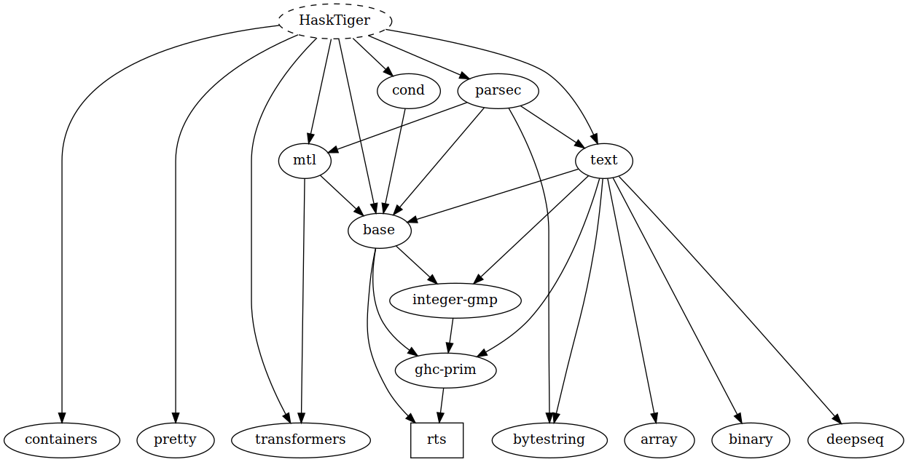

# HaskTiger

Bienvenid@s!

El código proporcionado en este repo es un esqueleto básico para el desarrollo
de la materia de Compiladores de Lcc. En general se trató de ser lo más prolijo
posible, dejando además lugar (y libertad) al estudiante que esté dispuesto a
jugar un poco más con Haskell y Tiger.

Seguí lo más que pude las ideas que se presentan en el
[libro](https://www.cs.princeton.edu/~appel/modern/ml/) y en las clases para que
puedan seguirlo de forma más sencilla y que las clases les sean de utilidad.

<!-- markdown-toc start - Don't edit this section. Run M-x markdown-toc-refresh-toc -->
**Tabla de Contenidos**

- [HaskTiger](#hasktiger)
    - [Archivos](#archivos)
    - [Metodología General](#metodología-general)
        - [Metodología Particular. Mónada(s)](#metodología-particular-mónadas)
        - [Extensiones de Haskell](#extensiones-de-haskell)
    - [Cuestiones Prácticas de Haskell/GhC/Cabal/Stack](#cuestiones-prácticas-de-haskellghccabalstack)
        - [ProTip:](#protip)
    - [Testing](#testing)
    - [TODO](#todo)

<!-- markdown-toc end -->


## Archivos

El proyecto está modularizado en diferentes archivos que pueden encontrar en `src/`

Archivos relacionados a etapas del compilador.
+ [TigerLexer](src/TigerLexer.hs)/ [TigerParser](src/TigerParser.hs): Analizador lexicográfico y parser (**gratis**), `text -> Exp`.
+ [TigerEscap.hs](src/TigerEscap.hs): Cálculo de variables escapadas(**gratis**), `Exp -> Exp`.
+ [TigerSeman](src/TigerSeman.hs): Análisis Semántico, inferidor de tipos, `Exp -> Exp`.
+ [TigerTrans](src/TigerTrans.hs): Generador de código intermedio, `Exp -> Stm`.
+ [TigerCanon](src/TigerCanon.hs): Canonizador de código intermedio(**gratis**), `Stm -> [Stm]`.

Nota: Faltan archivos relacionados a las ultimas etapas, o a la ultima etapa. Ya son grandes
deberían poder manejarse solitos.

Archivos que contienen las estructuras a manipular:
+ [TigerAbs](src/TigerAbs.hs): Contiene el `Exp`.
+ [TigerTree](src/TigerTree.hs): Contiene el código intermedio `Stm`.

Archivos Auxiliares:
+ [TigerErrores](src/TigerErrores.hs): Contiene la clase `Daemon` para el computo de errores.
+ [TigerFrame](src/TigerFrame.hs): Abstrae el frame de la arquitectura a elegir.
+ [TigerPretty](src/TigerPretty.hs): PP de código fuente.
+ [TigerPrettyIr](src/TigerPrettyIr.hs) : PP de código intermedio.
+ [TigerSres](src/TigerSres.hs): Representación de valores/funciones en las tabla de entornos, útiles para las primeras etapas.
+ [TigerSymbol](src/TigerSymbol.hs): Encapsulamiento de la librería Text.
+ [TigerTemp](src/TigerTemp.hs): Manejo de Temporales y Labels, con la clase `TLGenerator`.
+ [TigerTip](src/TigerTip.hs): Estructura de los tipos.

Archivos Totalmente Inestables:
+ [TigerTraversals](src/TigerTraversals.hs): Traversals para el AST (estaba aburrido)
+ [TigerInterp](src/TigerInterp.hs): Idealmente debería estar acá un interprete de código intermedio.

.
├── app
│   └── TigerMain.hs
├── doc
│   └── dep.png
├── HaskTiger.cabal
├── LICENSE
├── README.md
├── runtime.c
├── Setup.hs
├── src
│   ├── TigerAbs.hs
│   ├── TigerCanon.hs
│   ├── TigerErrores.hs
│   ├── TigerEscap.hs
│   ├── TigerFrame.hs
│   ├── TigerInterp.hs
│   ├── TigerLexer.hs
│   ├── TigerParser.hs
│   ├── TigerPretty.hs
│   ├── TigerPrettyIr.hs
│   ├── TigerSeman.hs
│   ├── TigerSres.hs
│   ├── TigerSymbol.hs
│   ├── TigerTemp.hs
│   ├── TigerTips.hs
│   ├── TigerTrans.hs
│   ├── TigerTraversals.hs
│   └── TigerTree.hs
├── stack.yaml
├── test
│   ├── EscapTesting.hs
│   ├── Interp.hs
│   ├── Parser.hs
│   ├── Spec.hs
│   ├── test_code
│   └── Tools.hs

## Metodología General

Cada algoritmo importante está separado en dos abstracciones, un *Mini edsl* y
la implementación concreta del algoritmo.

Por ejemplo, para el algoritmo de análisis semántico (tipado) en [TigerSeman]
van a encontrar una clase llamada [Manticore] que
posee entre otros los siguiente métodos
```
class (...) => Manticore w where
  -- | Inserta una Variable al entorno
    insertValV :: Symbol -> ValEntry -> w a -> w a
  -- | Inserta una Función al entorno
    insertFunV :: Symbol -> FunEntry -> w a -> w a
  -- | Inserta una Variable de sólo lectura al entorno
    insertVRO :: Symbol -> w a -> w a
  -- | Inserta una variable de tipo al entorno
    insertTipoT :: Symbol -> Tipo -> w a -> w a
  -- | Busca una función en el entorno
    getTipoFunV :: Symbol -> w FunEntry
  -- | Busca una variable en el entorno
    getTipoValV :: Symbol -> w ValEntry
    ...
```

Que nos proveen una interfaz para el uso de un entorno, bastante limitado, que
sólo nos permite insertar y obtener ciertos valores (no podemos meterle lo que
queramos).

Y luego el algoritmo de análisis semántico propiamente dicho separado en 3 partes (los 3 tipos mutuamente recursivos)
```
transExp :: (Manticore w) => Exp -> w (() , Tipo)
transVar :: (Manticore w) => Var -> w (() , Tipo)
transDecs :: (Manticore w) => [Dec] -> w a -> w a
```
De esta manera tenemos todos los métodos disponibles de forma *abstracta*. Para ejecutar `transExp` vamos a tener
que proporcionar una instancia concreta de `Manticore`.

Esto nos permite por un lado olvidarnos de cuestiones de acceso a estructuras,
en algún momento tendremos que decidir qué es un entorno, qué estructuras
utilizamos, qué mónada, etc. Pero al momento de concentrarnos en escribir el
algoritmo de inferencia de tipos, todo eso no nos importa. Lo malo es que no
vamos a poder correrlo hasta que hayamos tomado todas esas decisiones.

### Metodología Particular. Mónada(s)

Claramente las mónadas son una parte importante de todo esto, particularmente
porque vamos a poder secuenciar la forma de escribir los algoritmos (usando [do
notation](https://en.wikibooks.org/wiki/Haskell/do_notation)) y ocultar efectos.

En general podes hacer todo con una gran y maravillosa mónada de estados, el
compilador como está planteado no hace más que modificar diferentes entorno y en
base a eso realizar ciertas modificaciones a una estructura de datos.

No hace falta en sí tenerla súper clara con las mónadas (yo particularmente no
entiendo nada de nada y escribí **alto readme**) pero te podría venir bien tener
una idea general de [State
Monad](https://wiki.haskell.org/All_About_Monads#The_State_monad), [Reader
Monad](https://wiki.haskell.org/All_About_Monads#The_Reader_monad), [Error
Monad](https://wiki.haskell.org/All_About_Monads#The_Error_monad) y [Monad
Transformers](https://wiki.haskell.org/All_About_Monads#Monad_transformers).

No voy a explicar en sí que hacen cada mónada, pero manejando muy por arriba
cada concepto te va a ayudar a entender qué está pasando en cada parte.

En general cada clase que se defina, se tendrá que proveer una mónada con un
estado más un poco de manejo de errores. Para componer manejo de errores
interesante y estados, usamos *Monad Transformers* para componer el
comportamiento de dichas mónadas. La *Reader Monad* se utiliza para la
construcción de entornos donde se manejan variables (se imaginaran que en el
compilador esto se hace a menudo), si bien no la vamos a utilizar directamente
(la mónada de estados es un poco más que *de lectura*) la abstracción es más
limpia y sencilla en ciertos lugares.

De esta forma cada vez que insertamos algo en el entorno no lo haremos como un
efecto lateral sino que vamos a encapsular el comportamiento y permitir computar
de forma segura dentro de un nuevo entorno expandido.

Veamos un ejemplo, dentro de la clase `Manticore` vimos un método de inserción de variables en el entorno.
```
  ...
  -- | Inserta una Variable al entorno
    insertValV :: Symbol -> ValEntry -> w a -> w a
  ...
```
Método que nos permite dado un `Symbol` y un `ValEntry` ejecutar una computación `w a` dentro de un
entorno `env` (oculto dentro de la mónada `w`) donde además está cierta variable definida.
Es un concepto que ya deberían haberlo visto en alguna otra materia:

Sea `comp :: w a` una computación, la computación `insertValV "variable" TInt
comp` es semánticamente equivalente a pensar en *ejecutar a `comp` con un
entorno `env[("variable", TInt)]`*, es decir que expandimos el entorno con la
variable `variable`.

### Extensiones de Haskell

Usamos en general pocas extensiones al lenguaje, están más que invitados a
hacer lo que quieran con el código y usar las extensiones que quieran.
Hay un montón de [extensiones](https://downloads.haskell.org/~ghc/latest/docs/html/users_guide/lang.html)
al lenguaje que activan diferentes mecanismos sobre Haskell. Nosotros usaremos particularmente 5 extensiones:
+ [GADTs](https://downloads.haskell.org/~ghc/latest/docs/html/users_guide/glasgow_exts.html#generalised-algebraic-data-types-gadts)
+ [Lambda Case](https://downloads.haskell.org/~ghc/latest/docs/html/users_guide/glasgow_exts.html#lambda-case)
+ [Tuple Sections](https://downloads.haskell.org/~ghc/latest/docs/html/users_guide/glasgow_exts.html#extension-TupleSections)
+ [Type Families](https://downloads.haskell.org/~ghc/latest/docs/html/users_guide/glasgow_exts.html#extension-TypeFamilies)
+ [Flexible Instances](https://downloads.haskell.org/~ghc/latest/docs/html/users_guide/glasgow_exts.html#extension-FlexibleInstances)

## Cuestiones Prácticas de Haskell/GhC/Cabal/Stack

El proyecto utiliza a [Stack](https://docs.haskellstack.org/en/stable/README/)
que vendría a ser un [cabal](https://cabal) *mejorado*.

El proyecto tiene algunas dependencias que pueden ver en el siguiente gráfico:


Tanto las dependencias como los comandos a utilizar se manejan desde
[HaskTiger.cabal].

Para hacer build basta con ejecutar `stack build`. Como resultado tendrás a
*HaskTiger* como ejecutable con main `./app/TigerMain.hs` y podrás ejecutarlo
con `stack exec HaskTiger`.

En Haskell el compilador en sí es una librería. Es decir, que se puede incluir y
manipular como una librería de Haskell más. Los detalles y los módulos que tiene
los pueden en el archivo [HaskTiger.cabal].

Pueden ejecutar `stack exec $SHELL` donde estarán en una *shell* con el
ejecutable en *path* y con un entorno de Haskell con todos los paquetes
indicados en las dependencias.

Podes observar todos los targets de stack con `stack ide targets`.

### ProTip:

**Explorar** `HaskTiger.cabal** que es donde está definido todo lo que dije
arriba.

**Explorar a conciencia [mí
repo](https://bitbucket.org/martinceresa/tiger-compiler)**

## Testing

Utilizando *Stack* podemos generar diversas *testsuit* que pueden encontrar en
`./test`. Actualmente se encuentran las siguientes suit de pruebas:
+ `stack test :Parser`
+ `stack test :Escap`
+ `stack test :Interp`

## TODO

- [ ] Tiger Haskell Esqueleto
  * [x] Esqueleto Andando
  * [ ] Mejorar el TigerMain, modularizar el estado de los temporales como dos
        estados.
  * [x] Testing
  * [ ] Simplificación del algoritmo abusando de reader
  * [ ] Simplificación de otras partes del compilador
- [ ] Interprete Código Intermedio
  * [x] Parte Fácil ya está.
  * [ ] Parte difícil, llamada a de funciones.
- [ ] Representación de Ciertas Máquinas. Necesito gente que llegue al final
      del compilador.
- [ ] Terminar de documentar todo:
  * [ ] Monadas
  * [x] Extensiones
  * [ ] Lazy Top Sort
  * [x] Algoritmos a la Haskell
